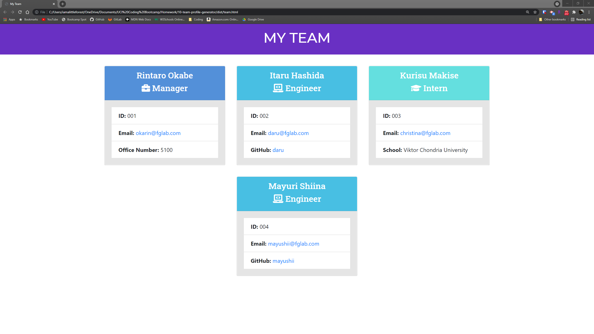

# Team Profile Generator

## Languages & Technologies
* HTML / CSS / Javascript
* Node.js
* Inquirer Package
* Jest Package

## Description
This application takes in information about employees on a software engineering team, then generates an HTML webpage that displays summaries for each person.

## Screenshot

## Demo
[Walkthrough Video](https://iamalittleforest.github.io/10-team-profile-generator/assets/images/README-walkthrough.mp4)

## License
MIT License

## Contact Information
Wendy Kobayashi (<wykobayashi@gmail.com>)